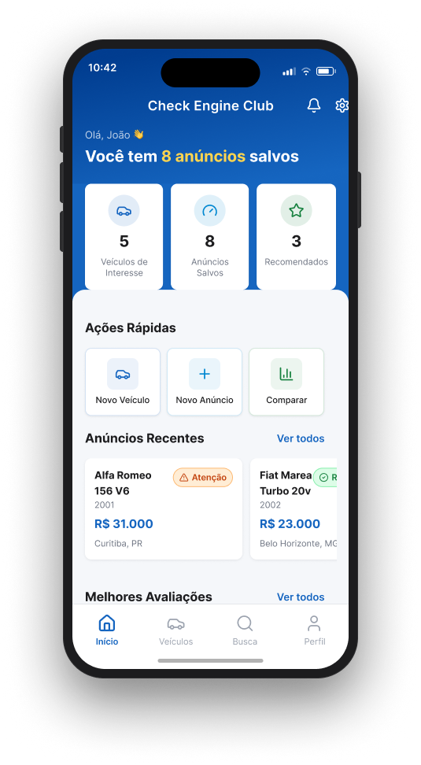
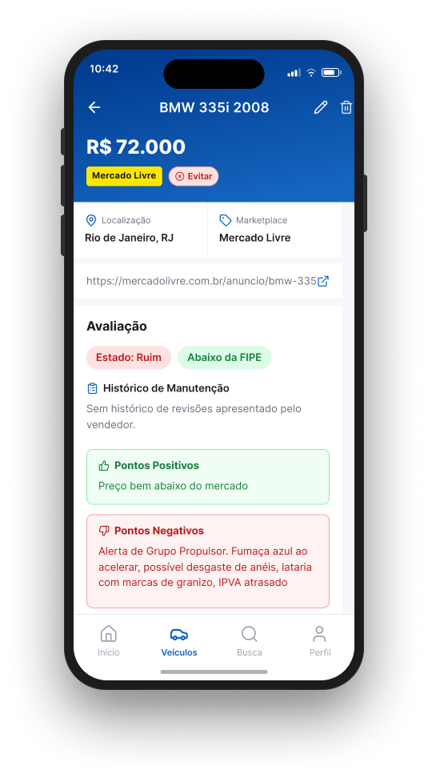
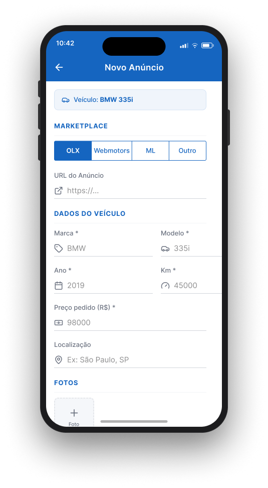
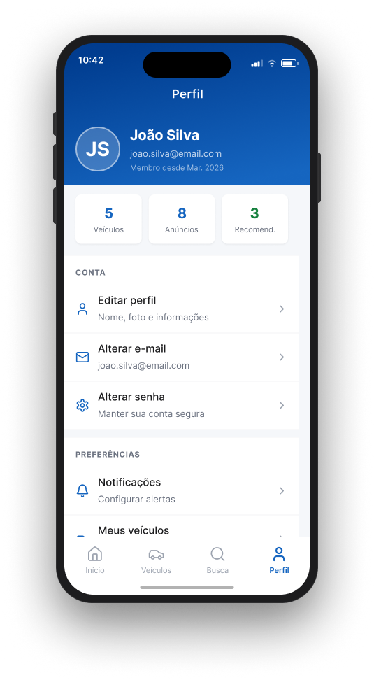
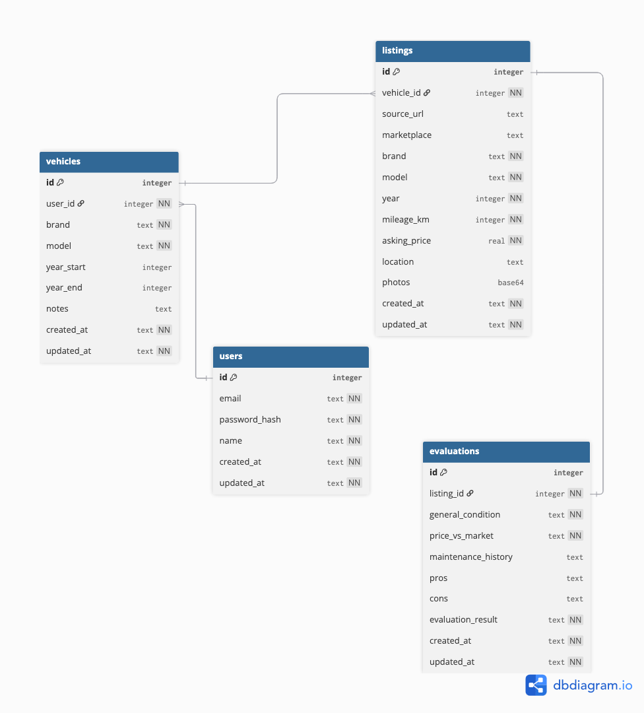

# Check Engine Club

## Sobre

Check Engine Clube é uma aplicação móvel desenvolvida para auto entusiastas, ajudando-os a avaliar se um carro usado é uma boa opção para compra ou não.

Se a sua garagem ainda não possui manchas de óleo o suficiente, você está com a vida tranquila e qier um pouco mais de emoção no seu dia-a-dia essa aplicação te ajudará a encontrar o seu novo carro velho!

O objetivo da aplicação fornecer ao usuário um espaço em que ele possa adicionar uma marca e modelo de veículo de interesse. E dentro desse escopo adicionar anúncios de venda de carros dessa marca/modelo de diferentes marketplaces para poder avaliar se o carro é uma boa opção para compra ou não. 

### Features

**Autenticação do Usuário**
* Cadastro de novo usuário (e-mail/senha ou login social)
* Login / Logout
* Recuperação de senha

**Gerenciamento de Veículos de Interesse**
Adicionar um veículo de interesse informando:
* Marca (ex.: BMW, Honda, VW)
* Modelo
* Ano ou faixa de anos de interesse (opcional)
* Notas gerais sobre o modelo (ex.: "atenção ao VANOS", "problema comum de câmbio")
* Editar e Remover veículos de interesse
* Listar todos os veículos cadastrados pelo usuário

**Gerenciamento de Listagens de Carros**

Dentro de um veículo de interesse, o usuário pode adicionar anúncio de carro à venda, com dados como: Link do anúncio original (marketplace de origem: OLX, Webmotors, Mercado Livre, etc.)
* Marca / Modelo / Ano
* Quilometragem
* Preço pedido
* Localização
* Fotos
* Editar um anúncio salvo
* Remover um anúncio

**Avaliação / Classificação do Carro**
Permitir que o usuário avalie cada listagem com critérios como:
* Estado geral (bom, regular, ruim)
* Relação preço/valor de mercado
* Histórico de manutenção (se houver)
* Pontos positivos e negativos
* Gerar uma recomendação para cada anúncio (ex.: recomendado, atenção, evitar)
* Comparação entre anúncios do mesmo modelo

**Busca e Filtros**
* Buscar por veículos de interesse (marca/modelo)
* Dentro de um veículo, filtrar listagens por preço, km, nota
* Filtrar veículos por quantidade de listagens, melhor avaliação, etc.

**Dashboard - Tela Inicial**
Visão geral e ao abrir o app. Exibe um resumo com:
* Quantidade de anúncios salvas
* Anúncios adicionados recentemente
* Acesso rápido às principais ações (adicionar veículo de interesse, adicionar anúncio)

[//]: # (The Bavarian Lottery)
[//]: # (VanosCheck)
[//]: # (the one)
[//]: # (Ultimate Repair Machine)
[//]: # (Buy Now Cry Later)
[//]: # (VanosScore)

[//]: # (jokester
Here are a few:
	•	“BMW: The Ultimate Driving Machine… to the service center.”
	•	“That ‘drivetrain malfunction’ warning is just BMW’s way of asking whether you miss your mechanic.”
	•	“My BMW doesn’t have check-engine lights. It has subscription reminders for emotional resilience.”
	•	“A BMW drivetrain malfunction is like a German way of saying, ‘Today, you take ze Uber.’”
	- “BMW owners don’t read fault codes, they build relationships with them.”
    - Bavarian Money Waster.
    conforto, potência e 3 avisos no painel
     consumo de óleo e
	bonita até entrar em modo de emergência
)

**Possíveis futuras melhorias**

- adicionar a aplicação serviço que baseado na sua localização fornece informações sobre oficinas mecânicas, auto-peças ou serviços de guincho mais próximos.

## Tecnologias utilizadas

Planeja-se desenvolver o projeto utilizando as seguintes tecnologias:
- Expo Go
- RNE (React Native Elements)
- SQLite

Futuramente planeja-se user firebase para autenticar na aplicação

[//]: # (TODO descrever corretamente como executar em ambiente de desenvolvimento)
[//]: # (`git clone repo check-engine-club`)

[//]: # ()
[//]: # ()
[//]: # (`cd check-engine-club`)

[//]: # ()
[//]: # (`yarn install`)

[//]: # ()
[//]: # (`yarn start`)

## telas

[Telas no figma](https://www.figma.com/design/RhGM8UjKiJ6Ta1OzyLEKXo/Check-Engine-Club-Prototype?node-id=0-1&t=lNkGuw7ApXVvBWf1-1)

 

 

 

## modelagem do banco de dados

[Modelo de banco de dados](https://dbdiagram.io/d/check-engine-club-DBML-69d6ad7680896296844e7e42)

Banco de dados SQLite implementado localmente. Posteriormente pode ser implementada autenticação com firebase alterando principalmente a tabela users do modelo de banco de dados.

Entidades do modelo: users, vehicles, listings e evaluations.

Na implementação com SQLite a relação de chave estrangeira implica em `ON DELETE CASCADE`. Removendo o usuário, todos os dados que o referenciam como foreign key também são deletados.

**relações 1:N**
- users -> vehicles
- vehicles -> listings

**relações 1:1**
listings -> evaluations

## sprints

- [ ] **sprint 0** - 1 semana: estruturação inicial do projeto. Criar ambiente de desenvolvimento com Expo Go e expo router, criar migrations para o banco, configurar thema para React Native Elements;
- [ ] **sprint 1** - 2 semanas: autenticação e auth-guards (auth guards para permitir que o projeto seja expandido para autenticação via firebase com armazenamento de dados local no banco SQLite.);
- [ ] **sprint 2** - 1 semanas: implementação de CRUD para veículos de interesse; levantamento origem de dados para marketplaces de origem e também de marcas e modelos de carros;
- [ ] **sprint 3** - 1 semanas: implementação tela de detalhes de anúncio de venda de carros;
- [ ] **sprint 4** - 1 semana: implementação de métricas de avaliação dos carros (anuncio: recomendado, atenção, evitar), estado de conservação (bom, regular, ruim); preço (acima da fipe, abaixo da fipe, na fipe) e badges para métricas;
- [ ] **sprint 5** - 2 semana: dashboard. Implementação funcionalidade de ações rápidas, cards para anúncios adicionados recentemente, melhores anúncios, estatísticas gerais;
- [ ] **sprint 6** - 1 semana: busca e filtros;
- [ ] **sprint 7** - 1 semana: teste de usabilidade; listagem e correção de bugs;

**Tempo total estimado para desenvolvimento do projeto de aproximadamente 10 semanas.**

---

Projeto desenvolvido para disciplina TSI35A - Projetos de dispositivos Móveis da UTFPR - Guarapuava, Curso de Sistemas para internet.